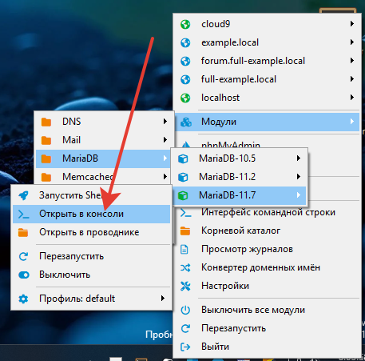
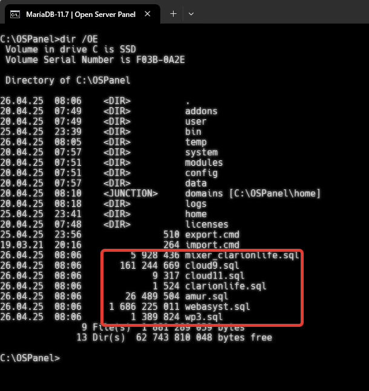

Кидаем файлы в корень. К примеру в C:\OSPanel

Запускаем консоль

В консоли набираем Export + Enter и получаем в результате ваши базы в sql файлах 

После переустановки делаем ту же операцию только с импортом